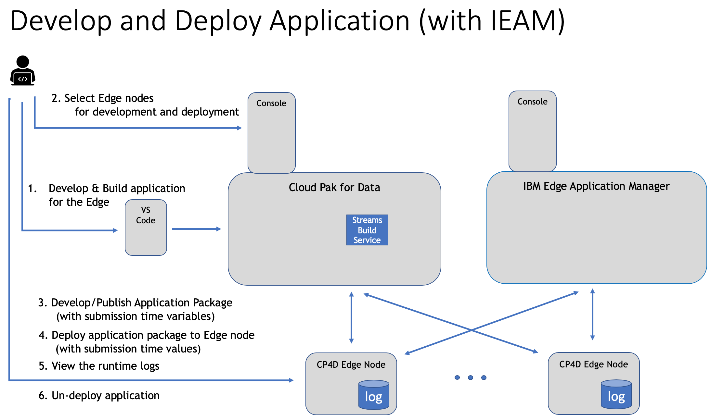

# sample.edge-app-control
Application control sample

#Brad's new sample documention.
When writing a guide or article about how to perform a specific task, here are some tips to speed up writing time and improve the quality of the finished article.

# Preparing to write

Some questions to help you identify the key information to highlight:
* What pain points does this task address? Who would be interested in learning this information?

* If I was a developer trying to find this article, what keywords would I be using to search for it? 
   * Are those keywords highlighted early in the article?
* Is there a real-world problem or user story around which you can frame the article?

* What are the key points they need to know? E.g. They must use the X operator with parameters a,b, and c. 

# Before you Start Writing
If the article has a long list of instructions, put together a table of contents first to organize the flow of the instructions.

Examples:
* https://developer.ibm.com/streamsdev/docs/streams-quick-start-guide/
* https://developer.ibm.com/streamsdev/2018/01/12/calculate-moving-averages-real-time-data-streams-designer/
* https://developer.ibm.com/streamsdev/docs/common-patterns-tracking-moving-objects-streams-part-2-geofencing/

You can create links to sections in the doc using the anchor tag, e.g:

```
- [step 1](#step1)
- [step 2](#step2)
...
<a id="step1">
<h2>Step 1</h2>
```

The section below outlines things that you should cover, but your outline and table of contents are important to flush out first.

# Sample outline

## Introduction
The objective of this sample is to illustrate the steps involved with developing an SPL application for the Edge.  It will start with the application SPL source code, proceed to the application build process, followed by deployment (including configuration) to the edge nodes, and finish with examining the runtime output.

The runtime behavior of a Streams Edge application may be configured at deployment time via the following two mechanisms.

- **_submission time variables_**.  These are optional, application specific variables that are defined in the application. The application code determines how the values passed in for these variables at deployment time affects the behavior of the application at runtime.

- **_runtime options_**.  These control more basic built-in capabilities and therefore available for every application.  The set of supported built-in options are described in [runtime-options](#runtime-options).

This article will use an SPL sample application that has some submission time variables defined in it.  It will show how values for these variables, and the trace runtime-options, can be passed into the application at deploy time.  Also, it will show how the resulting trace statements can be viewed.

## Skill Level 

* The sample program is written in SPL, so an elementary understanding of SPL might help understanding the sample better.  See SPL reference below.
* Expected skills level - what does the reader need to know to understand this article?
* If the user does not have the required skills, where should they go to learn more? 

## Requirements/Information to collect 

* The VSCode tool will be used in this sample. For more information on how to install and setup Visual Studio Code for use in this sample, see:  
<http://ibmstreams.github.io/streamsx.documentation/docs/spl/quick-start/qs-1b/>

* You will need the following information prior to starting this sample exercise:   
    - IBM Cloud Pak for Data information
        - **_version_**: You can find the version number in the About section after logging in to the IBM Cloud Pak for Data environment in your browser.
        - **_web client URL_**: This is the URL used to access the IBM Cloud Pak for Data environment in your browser. It should be of the form: https://HOST:PORT (e.g., https://123.45.67.89:12345).
        - **_credentials_**
        : These are the credentials (username and password) used to log in to the IBM Cloud Pak for Data environment in your browser. 
    - credentials (username and password) for Edge nodes
    - EAM Scenario only
        - API key for EAM access
        - open shift cluster url & credentials (user & api-key)


## Steps 

This sample will show how to develop and deploy the application with and without EAM.  The high level steps are the same for both of these cases.  The individual steps will point out when there is difference between these two scenarios.
1. Develop Application
1. Build Application for the Edge
1. Select Edge nodes to use
1. Develop/Publish Application
1. Deploy Application
1. View log

While the steps are the same for both scenarios, the detailed steps has some differences in them.  These detailed flows will be described separately.  

### Scenario#1 - Develop and deploy application without IBM Edge Application Manager


1. Develop application (via VS Code)

    In this sample we use a predefined sample application called "TracesAppCloud.spl".  It is an SPL application that shows a simple SPL application that reads some stock ticker entries, does a simple calculation on them, and then writes them out. It will continue doing this in a loop.

    For the purpose of this sample, some additional statements have been added to the application to show examples of how to define and reference submission time variables, and how to add application trace statements to output these values into the application log.
    
    Search for "LOOK HERE" to see the section of the application that is most relative to this sample.
    
    Notice the names for the two submission time variable names as they will be needed later on. 
    - _mySubmissionTimeVariable_string_
    - _mySubmissionTimeVariable_listOfStrings_
    
    Note: if there is a naming conflict with submission time variables with different parts of the your application, or if you do not have access to the application source code, you will need to retrieve the names of the supported variables by following the "Retrieving service variables for edge applications" topic.  The information retrieved by performing these for this sample application are shown in the attached files:
        - config-files/app-definition.json
        - runtime-options.json
    
    
    
    To further demonstrate, you may customize the "yourName" string in the application to see how it gets printed to the output log.
    
1. Build application for the Edge (via VS Code)
    - Use the VSCode tool to compile the SPL application code, and ultimately build into a Docker image.
        1. Right click in the TradesAppCloud_withLogTrace application, and select "Build"
            - Monitor the console output until the "Successfully build the application" message is displayed
        1. Right click in the TradesAppCloud_withLogTrace application, and select "Build Edge Application Image"
            - When prompted, select the base image that contains "streams-edge-base-application", and enter "tradesappcloud-withlogtrace" for image name, and "1.0" for image tag
            - Invoke "Build image"
            - Monitor the console output until "Successfully built the edge application image", and take note of the imagePrefix from the Image Details.
        
1. Select Edge Node(s) for development and deployment (via CP4D Console)
    To see list of Edge nodes that have been tethered to this CPD instance, do these steps:
    1. login in to CPD Console
    1. Select Navigation Menu > Analyze > Edge Analytics > Remote systems
        This will display a list of the available nodes. Select one of the _analytics-micro-edge-system_ type nodes.

1. Develop / Publish application package 
    
    - Login to CP4D Console, and perform these steps. For more informations, see "Packaging using Cloud Pak for Data" topic. 
        1. Select CPD Console > Navigation Menu > Analyze > Edge Analytics > Analytics apps
        1. Add Application packages
            | Field | Value |
            | ----- | ----- |
            | Name | app control sample | 
            | Version | 1.0 |
            | Image reference | tradesappcloud-withlogtrace:1.0 | 
        1. Scroll down to Additional attributes > Environment variables
        
            | Variable Name | Value |
            | ------------- | ----- |
            | mySubmissionTimeVariable_string | MyFavoriteFootballTeams |
            | mySubmissionTimeVariable_listOfStrings | Vikings,Packers,Lions,Bears |
            | STREAMS_OPT_TRACE_LEVEL | 3  | 
        1. Save
    
1. Deploy application package to an Edge node 
    - Login to CP4D Console, and perform these steps. For more informations, see "Deploying using Cloud Pak for Data" topic. The values for the submission time variables can not be changed at this time.
        1. Select CPD Console > Navigation Menu > Analyze > Edge Analytics > Analytics apps
        1. Go to row with "app control sample" > select three dots at end for row > Deploy to edge
            1. Select check box for remote system to deploy to.
            1. Select Deploy option.
        1. Select "app control sample"
            1. Look at Application instances
                - verify that there is entry for a deployment

1. View the runtime logs (ssh to CP4D Edge node chosen for deployment)
        The system log file contains several messages from many different sources.  To filter off what you are interested requires using grep'g techniques.
            - See all messages for service
                - cat /var/log/syslog | grep image-name
            - See all trace messages for service - trace statements
                - cat /var/log/syslog | grep image-name | grep apptrc
                    Notice the xxx statements produced from the application trace statements.
                    Notice also that they contain the variable values that we inputted.


### Scenario#2 - Develop and deploy application with IBM Edge Application Manager



1. Develop application (via VS Code)
    - same as Scenario#1
    
1. Build application for the Edge (via VS Code)
    - same as Scenario#1
        
1. Select Edge Node(s) for development and deployment (via CP4D Console)
    To see list of Edge nodes that have been tethered to this CPD instance, do these steps:
    1. login in to CPD Console
    1. Select Navigation Menu > Analyze > Edge Analytics > Remote systems
        This will display a list of the available nodes.  Select one of the _ieam-analytics-micro-edge-system_ type nodes for the development system.  Also, select one of these for the deployment system.  It can be the same system.

1. Develop / Publish application package 
    - ssh to CP4D Edge node chosen for development and perform the following steps.  For more information, see the "Packaging an edge application service for deployment by using Edge Application Manager" topic.  The submission time variables from the application discovered in step #1 above will be included in the resulting application package. The values for the variables are not specifed as part of the application package.
        1. Install the OpenShift® command-line interface. See xxxx.
        1. Setup the environment variables
            - eval export $(cat agent-install.cfg)
            - export HZN_EXCHANGE_USER_AUTH= _my_eam_api_key_
            - export OCP_USER="cpd-admin-sa"
            - export OCP_DOCKER_HOST=_default-route-to-openshift-image-registry_
            - export OCP_TOKEN=_cpd-admin-sa_openshift-token_
            - export IMAGE_PREFIX=_imagePrefix_   // from build step
        1. Login to OpenShift and Docker
            - oc login _openshift_cluster_url:port_ --token $OCP_TOKEN --insecure-skip-tls-verify=true
            - docker login $OCP_DOCKER_HOST --username $OCP_USER --password $(oc whoami -t)
        1. Pull the edge application image to the development node
            - docker pull $OCP_DOCKER_HOST/$IMAGE_PREFIX/tradeswithlogtrace:1.0
        1. Create EAM service project
            1. mkdir app_control_sample; cd app_control_sample
            1. hzn dev service new -s app-control-sample-service -V 1.0 --noImageGen -i $OCP_DOCKER_HOST/$IMAGE_PREFIX/tradeswithlogtrace:1.0
        1. Add submission time variables and runtime-option:trace
            1. vi horizon/service.definition.json
            1. insert the submission time variables into the "userInput" array such that it looks like this:
                ```
                {
                    "org": "$HZN_ORG_ID",
                    "label": "$SERVICE_NAME for $ARCH",
                    "description": "",
                    "public": true,
                    "documentation": "",
                    "url": "$SERVICE_NAME",
                    "version": "$SERVICE_VERSION",
                    "arch": "$ARCH",
                    "sharable": "multiple",
                    "requiredServices": [],
                    "userInput": [
		                  {
			                 "name": "mySubmissionTimeVariable_string",
			                 "type": "string",
			                 "defaultValue": "defaultValue"
		                  },
		                  {
			                 "name": "mySubmissionTimeVariable_listOfStrings",
			                 "type": "list of strings",
			                 "defaultValue": "defaultFirstListElement,defaultSecondListElement"
		                  },
                            {
                                "name": "STREAMS_OPT_TRACE_LEVEL",
                                "label" : "Tracing level: 0=OFF, 1=ERROR, 2=WARNING, 3=INFO, 4=DEBUG, 5=TRACE",
                                "type": "string",
                                "defaultValue": "1"
                            }
                    ],
                    "deployment": {
                        "services": {
                            "tradesappcloud-withlogtrace": {
                            "image": "$OCP_DOCKER_HOST/$IMAGE_PREFIX/tradesappcloud-withlogtrace:1.0",
                            "privileged": false,
                            "network": ""
                            }
                        }
                    }
                }
                ```
            

1. Deploy application package to an Edge node 
    - ssh to CP4D Edge node chosen for deployment and perform the following steps.  For more information, see the "Deploying using Edge Application Manager" topic.  The values for the submission time variables from the application will be specified during deployment.
        1. vi userinput.json and add the following json to it.
        
        ```
                {
                    "services": [
                        {
                            "org": "$HZN_ORG_ID",
                            "url": "sample-trace",
                            "variables": {
                                "mySubmissionTimeVariable_string": "MyFavoriteFootballTeams",
                                "stv_strings": ["Vikings,Packers,Lions,Bears"],
                                "STREAMS_OPT_TRACE_LEVEL" : "3"
                            }
                        }
                    ]
                }       
        ```

1. View the runtime logs (ssh to CP4D Edge node chosen for deployment)


* Outline major steps to complete the task, e.g. They must use the X operator with parameters a,b, and c. State that early and repeat it a couple of times. 
* Discuss details about each step
   * Keep the steps to the point and concise.
   * Make sure there is validation at the end of each step ... so the user knows that they have completed the steps successfully.  i.e. what should the user see at the end of each major step?

Avoid discussing information that is interesting/cool but that a user, especially a novice, does not need to know to complete the task.

## Additional Resources / What's Next?

* List of resources to help the user learn more about the task?
* What can they do next?


* SPL reference


